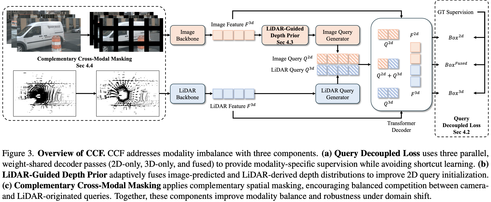
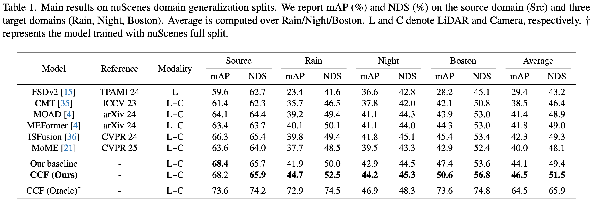

# CCF: Complementary Collaborative Fusion for Domain Generalized Multi-Modal 3D Object Detection

*Accepted at CVPR 2026*

<p align="center">
  <a href="https://arxiv.org/abs/2603.23276"></a>
  <a href="https://huggingface.co/Curiosity-Wu/CCF"></a>
</p>

If you find this repository helpful, a star would be greatly appreciated.

## Abstract

Multi-modal fusion has emerged as a promising paradigm for accurate 3D object detection. However, performance degrades substantially when deployed in target domains different from training. In this work, focusing on dual-branch proposal-level detectors, we identify two factors that limit robust cross-domain generalization: 1) in challenging domains such as rain or nighttime, one modality may undergo severe degradation; 2) the LiDAR branch often dominates the detection process, leading to systematic underutilization of visual cues and vulnerability when point clouds are compromised.

To address these challenges, we propose three components. First, Query-Decoupled Loss provides independent supervision for 2D-only, 3D-only, and fused queries, rebalancing gradient flow across modalities. Second, LiDAR-Guided Depth Prior augments 2D queries with instance-aware geometric priors through probabilistic fusion of image-predicted and LiDAR-derived depth distributions, improving their spatial initialization. Third, Complementary Cross-Modal Masking applies complementary spatial masks to the image and point cloud, encouraging queries from both modalities to compete within the fused decoder and thereby promoting adaptive fusion.

Extensive experiments demonstrate substantial gains over state-of-the-art baselines while preserving source-domain performance.

## Framework



## Main Results



## Reproduction

This README is intended to be runnable end-to-end for reproduction. A coding agent can use it to set up the environment, download the released assets, and run the split evaluation; we tested this workflow with Codex using GPT-5.5.

## Environment

The release uses a Torch 2 based MMDetection/MMDetection3D stack provided through submodules.

Clone with submodules, or initialize them after cloning:

```bash
git submodule update --init --recursive
```

The required third-party repositories are tracked as submodules:

```text
thirdparty/mmcv_torch2
thirdparty/mmdetection_ccf
thirdparty/mmdetection3d_ccf
thirdparty/nuscenes-devkit_ccf
```

A setup script is provided as a reference for the installation sequence tested on NVIDIA RTX 5090:

```bash
conda create -n ccf python=3.10 -y
conda activate ccf
bash setup.sh
```

If your CUDA or driver stack differs, adjust the PyTorch and spconv wheels accordingly.

## Data

Place the official nuScenes data under `data/nuscenes/` with the standard layout:

```text
data/nuscenes/
├── maps/
├── samples/
├── sweeps/
└── v1.0-trainval/
```

If nuScenes already exists elsewhere, using a symlink is sufficient.

CCF also needs generated info files and source/target split pkl files. They can be downloaded from the Hugging Face assets repo:

```bash
pip install -U huggingface_hub
hf download Curiosity-Wu/CCF \
  --repo-type model \
  --local-dir . \
  --include "data/nuscenes/nuscenes_infos*.pkl" "data/nuscenes/splits/*"
```

The CCF configs expect these source split files:

```text
data/nuscenes/splits/nuscenes_infos_train_singapore_norain_day_source.pkl
data/nuscenes/splits/nuscenes_infos_val_singapore_norain_day_source.pkl
```

The split evaluation configs expect:

```text
data/nuscenes/splits/nuscenes_infos_val_night_target.pkl
data/nuscenes/splits/nuscenes_infos_val_rain_target.pkl
data/nuscenes/splits/nuscenes_infos_val_boston_target.pkl
```

The released assets already include the required source and target split files. To create splits locally instead, first regenerate the full nuScenes info files:

```bash
python tools/create_data_nusc.py \
  --root-path data/nuscenes \
  --version v1.0 \
  --extra-tag nuscenes \
  --max-sweeps 10
```

Then export the desired source/target split pkl files from the full `nuscenes_infos*.pkl` files with the scripts in `tools/nuscenes_data_split/`; see `tools/nuscenes_data_split/README.md` for the exact commands.

## Checkpoints

Download the released checkpoints and initialization weights:

```bash
hf download Curiosity-Wu/CCF \
  --repo-type model \
  --local-dir . \
  --include "checkpoints/*.pth"
mkdir -p checkpoints/eval
ln -sf ../ccf_source.pth checkpoints/eval/ccf_source.pth
```

The training configs expect two checkpoints:

```text
checkpoints/isfusion_source.pth
checkpoints/faster_rcnn_swint_fpn_source.pth
```

Both checkpoints are trained on the nuScenes source split. `faster_rcnn_swint_fpn_source.pth` is trained on 2D boxes obtained by projecting nuScenes 3D boxes from the source split onto images.

Split evaluation expects:

```text
checkpoints/eval/ccf_source.pth
```

## Training

Train the CCF model:

```bash
bash tools/dist_train.sh projects/configs/ccf/ccf_source.py 4
```

Train the source baseline:

```bash
bash tools/dist_train.sh projects/configs/ccf/baseline_source.py 4
```

## Evaluation

Evaluate the CCF checkpoint on the configured target splits. The reproduction run above used one GPU.
If multiple GPUs are available, prefer setting `GPUS` to the number of usable GPUs for faster evaluation:

```bash
GPUS=4 bash tools/eval_splits.sh
```

For a single-GPU run, use:

```bash
GPUS=1 bash tools/eval_splits.sh
```

The individual evaluation configs live under `projects/configs/ccf/eval/`:

```text
projects/configs/ccf/eval/ccf_source-night.py
projects/configs/ccf/eval/ccf_source-rain.py
projects/configs/ccf/eval/ccf_source-boston.py
```

## Notes on ISFusion Modifications

We modified the ISFusion detector used in this repository to obtain empirically better results in the CCF reproduction setting. The main changes from the original ISFusion implementation are:

1. The detection head decouples classification and regression. The decoder now produces separate classification and box features, and the prediction head uses the classification feature for heatmap prediction and the box feature for box regression.
2. The head adds a center refinement step before the final decoupled prediction. With the released one-layer decoder setting, the original ISFusion head predicts the final center as an offset from the initial proposal center. This version first refines the proposal center with a dedicated center decoder/head, then uses the refined center for the final classification and box prediction.

## Notes on Training Stability

The released training configs include two stability-oriented implementation choices introduced during CCF development: SigmaReparam, following [apple/ml-sigma-reparam](https://github.com/apple/ml-sigma-reparam.git), and CAdamW, following [hazdzz/c_adam](https://github.com/hazdzz/c_adam.git). We adopted them to mitigate occasional loss spikes during training.

## Citation

If you find CCF useful for your research, please cite:

```bibtex
@InProceedings{Wu_2026_CVPR,
  author = {Yuchen Wu and Kun Wang and Yining Pan and Na Zhao},
  title = {CCF: Complementary Collaborative Fusion for Domain Generalized Multi-Modal 3D Object Detection},
  booktitle = {Proceedings of the IEEE/CVF Conference on Computer Vision and Pattern Recognition (CVPR)},
  month = {June},
  year = {2026},
  pages = {18745-18754}
}
```

## Acknowledgement

This codebase builds on [MMDetection3D](https://github.com/open-mmlab/mmdetection3d.git), [MV2DFusion](https://github.com/wangzt-halo/MV2DFusion.git) and [ISFusion](https://github.com/yinjunbo/IS-Fusion).